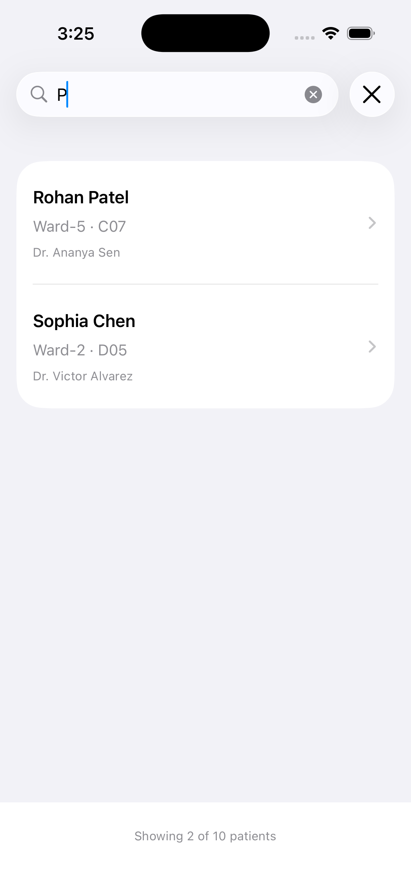

# PatientPortal-iOS

A comprehensive iOS application for managing patient information, viewing patient lists, searching patients, and accessing detailed patient summaries with clinical information.

## Features

- **Patient List**: Browse all patients with their ward location and assigned doctor
- **Patient Search**: Search functionality to find specific patients quickly
- **Patient Summary**: Detailed view showing patient information including:
  - Personal details (name, age, sex, MRN)
  - Location and ward assignment
  - Care team information
  - Clinical conditions and symptoms
  - Medications
  - Report download capability
- **Loading States**: Smooth loading indicators for data fetching
- **Responsive UI**: Clean, intuitive interface built with SwiftUI

## Screenshots

### Patient List
The main screen displays all patients with their basic information and assigned doctor.

	

### Search Functionality
Easily search for patients by name with real-time filtering.

	

### Loading State
Smooth loading indicator while fetching patient data.

	

### Patient Summary
Detailed patient information including clinical data, medications, and report download.

	

